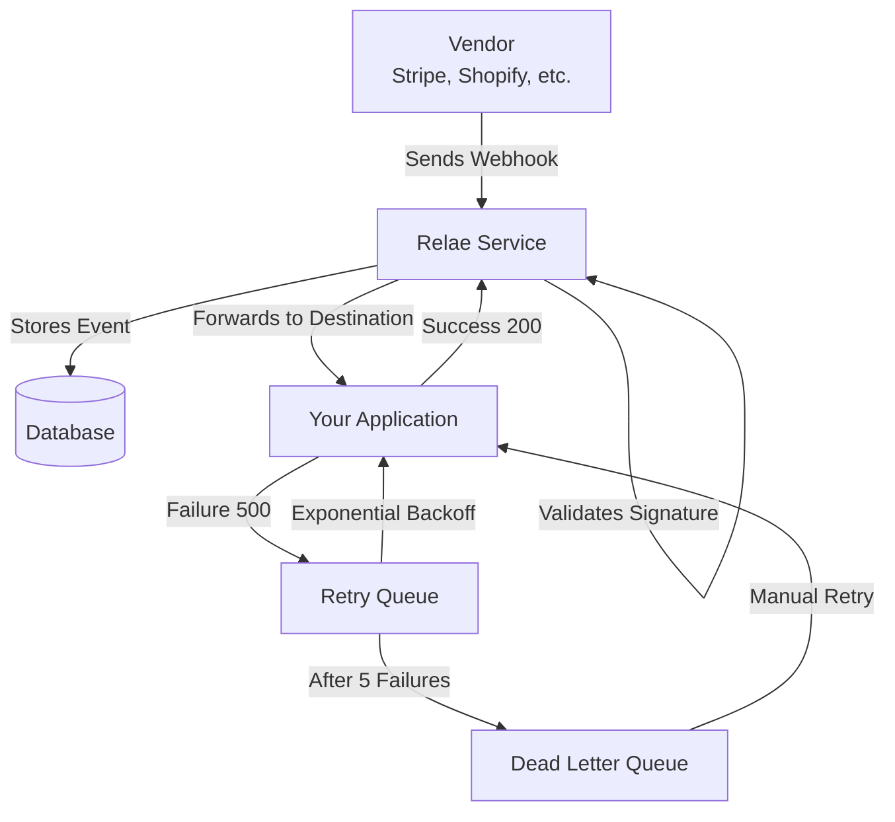
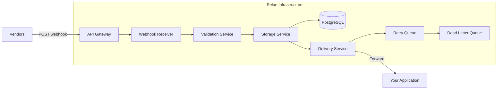

# What is Relae?

Relae is a **webhook relay service** that sits between your vendors (like Stripe, Shopify, GitHub) and your application, ensuring reliable webhook delivery with automatic retries, monitoring, and security features.

## The Problem Relae Solves

### Webhooks Are Critical But Unreliable

Modern applications rely on webhooks for real-time updates:

- Payment confirmations from Stripe
- Order updates from Shopify
- Code push notifications from GitHub
- Shipping updates from logistics providers

But webhooks have several inherent problems:

#### 1. Lost Events

If your server is down during maintenance or experiencing issues, webhooks are simply lost. Most vendors don't retry or have very limited retry logic.

#### 2. No Visibility

When webhooks fail, you often don't know why. Was it a network issue? Did your server timeout? Was the payload malformed?

#### 3. Difficult to Debug

Webhook failures happen at the worst times (deployments, server restarts, traffic spikes) and are hard to reproduce.

#### 4. Security Concerns

Verifying webhook signatures is complex and easy to get wrong, leaving your application vulnerable to attacks.

#### 5. Operational Overhead

You need to:

- Monitor webhook endpoints
- Implement retry logic
- Log all webhook events
- Handle signature verification
- Track failure rates

## How Relae Works

Relae acts as a reliable intermediary that handles all of this for you:

### Step-by-Step Process

1. **Vendor Sends Webhook**
   - Your vendor (e.g., Stripe) sends a webhook to your unique Relae endpoint
   - Example: `https://api.relaehook.com/webhook/abc123...`

2. **Relae Receives & Validates**
   - Relae receives the webhook immediately
   - If you provided a vendor webhook secret, Relae verifies the signature
   - Invalid signatures are rejected (event still stored for debugging)

3. **Event Storage**
   - Every webhook is stored in our database
   - Retention period based on your tier (7-30+ days)
   - Full payload, headers, and metadata preserved

4. **Forward to Your Application**
   - Relae forwards the webhook to your configured destination URL
   - Adds Relae-specific headers:
     - `X-Relae-Event-ID`: Unique event identifier
     - `X-Relae-Source`: The vendor name (e.g., `stripe`)
     - `X-Relae-Timestamp`: Unix timestamp
     - `X-Relae-Signature`: HMAC-SHA256 signature for verification
     - `User-Agent`: `Relae-Webhook-Forwarder/1.0`
   - Includes any custom headers you configured
   - Signs the outgoing webhook with HMAC-SHA2565. **Automatic Retry on Failure**
   - If your app returns an error (5xx) or times out
   - Relae automatically retries up to 5 times
   - Uses exponential backoff (5s, 25s, 125s, 625s, 3125s)

5. **Dead Letter Queue**
   - After 5 failed attempts, event moves to DLQ
   - You can review, debug, and manually retry anytime
   - Never lose a webhook event

## Key Features Explained

### 🔄 Automatic Retries

Most webhook providers either don't retry at all or have very limited retry logic. Relae retries intelligently:

| Attempt | Delay       | Total Wait Time |
| ------- | ----------- | --------------- |
| 1st     | Immediate   | 0s              |
| 2nd     | 5 seconds   | 5s              |
| 3rd     | 25 seconds  | 30s             |
| 4th     | 125 seconds | 155s (~2.5 min) |
| 5th     | 625 seconds | 780s (~13 min)  |

This gives your application plenty of time to recover from:

- Brief outages
- Deployments
- Database connection issues
- Temporary overload

### 📬 Dead Letter Queue (DLQ)

The DLQ is where events go after exhausting all retries. From the DLQ, you can:

- **Review** the full payload and headers
- **Debug** why delivery failed
- **Manually retry** individual events
- **Bulk retry** multiple events
- **See failure history** with timestamps

This means you'll never lose critical webhook data.

### 🔐 Security Features

#### Incoming Webhook Verification

- Relae verifies signatures from your vendor using their signing secret
- Invalid signatures are rejected before reaching your app
- Supports HMAC-SHA256, HMAC-SHA1, and other common methods

#### Outgoing Webhook Signing

- Every forwarded webhook is signed with HMAC-SHA256
- Uses a unique endpoint token per destination
- Prevents tampering and replay attacks
- [Learn how to verify signatures →](/guides/verifying-signatures)

#### Endpoint Isolation

- Each destination gets a unique endpoint URL
- If one endpoint is compromised, others remain secure
- Rotate endpoints anytime without affecting other integrations

### 📊 Monitoring & Analytics

Track your webhook health with:

- **Success/failure rates** over time
- **Response time metrics** from your application
- **Event volume charts** by day/hour
- **Source breakdown** (which vendors send most events)
- **Failed event analysis** (common failure reasons)

Available on Scale tier and above.

### ⚡ Performance

Relae is built for speed:

- **Sub-100ms processing** for most webhooks
- **Concurrent delivery** to multiple destinations
- **Global infrastructure** for low latency worldwide
- **99.9% uptime SLA** (Enterprise tier)

## Architecture

### High-Level Overview

### Components

1. **API Gateway**: Handles incoming webhook requests
2. **Webhook Receiver**: Fast webhook ingestion and validation
3. **Validation Service**: Verifies vendor signatures
4. **Storage Service**: Persists events to database
5. **Delivery Service**: Forwards webhooks to destinations
6. **Retry Queue**: Manages automatic retry logic
7. **Dead Letter Queue**: Stores permanently failed events

### Database Schema

Events are stored with:

- Unique ID
- Account ID (your account)
- Source (vendor name)
- Destination configuration
- Full payload (JSON)
- All headers
- Timestamps (received, forwarded, retried)
- Status (pending, delivered, failed)
- Retry count
- Failed reason (if applicable)

## Use Cases

### E-commerce Platforms

- Process Stripe payment webhooks
- Handle Shopify order updates
- Track shipping notifications
- Manage inventory updates

### SaaS Applications

- User signup events from authentication providers
- Subscription changes from billing systems
- Support ticket updates from help desk tools
- Monitoring alerts from infrastructure tools

### Development Teams

- GitHub push/PR webhooks for CI/CD
- Deployment notifications
- Error tracking from monitoring services
- Security alerts from scanning tools

### Financial Applications

- Payment confirmations
- Transaction updates
- Account balance changes
- Fraud detection alerts

## Comparison to Alternatives

### vs. Direct Vendor Integration

| Feature                | Direct           | Relae       |
| ---------------------- | ---------------- | ----------- |
| Setup complexity       | Medium           | Easy        |
| Retry logic            | Limited/None     | Intelligent |
| Failure visibility     | Poor             | Excellent   |
| Dead letter queue      | Manual           | Built-in    |
| Multi-vendor support   | Individual setup | Unified     |
| Signature verification | DIY              | Handled     |

### vs. Building Your Own

| Feature          | DIY Solution        | Relae    |
| ---------------- | ------------------- | -------- |
| Development time | Weeks               | Minutes  |
| Maintenance      | Ongoing             | None     |
| Monitoring       | Custom              | Built-in |
| Scalability      | Your responsibility | Handled  |
| Cost             | Engineer time       | $0-65/mo |
| Reliability      | Depends on you      | 99.9%    |

### vs. Message Queues (RabbitMQ, SQS)

Message queues are great for internal events but aren't designed for webhooks:

| Feature                | Message Queue | Relae         |
| ---------------------- | ------------- | ------------- |
| Webhook ingestion      | No            | Yes           |
| Signature verification | No            | Yes           |
| Retry logic            | Basic         | Intelligent   |
| Dead letter queue      | Yes           | Yes with UI   |
| Analytics              | Limited       | Comprehensive |
| Setup for webhooks     | Complex       | Simple        |

## Pricing & Tiers

| Tier       | Price  | Events/mo | Retention | Analytics |
| ---------- | ------ | --------- | --------- | --------- |
| Builder    | $0     | 10,000    | 7 days    | ❌        |
| Launch     | $35    | 100,000   | 14 days   | ❌        |
| Scale      | $65    | 500,000   | 30 days   | ✅        |
| Enterprise | Custom | Unlimited | Custom    | ✅        |

All tiers include:

- Automatic retries
- Dead letter queue
- HMAC signature verification
- Unlimited destinations
- Email support

[View detailed pricing →](https://relaehook.com/#pricing)

## Limitations

To set proper expectations:

### Rate Limits

- Free tier: 10,000 events/month
- Webhook size: Max 5MB per webhook
- Timeout: 30 seconds for destination response

### Retry Policy

- Maximum 5 retry attempts per event
- Total retry window: ~13 minutes
- After that, event moves to DLQ

### Data Retention

- Events auto-delete after retention period
- Upgrade tier for longer retention
- Export events before they expire

### Supported Signatures

Currently supports:

- HMAC-SHA256 (most common)
- HMAC-SHA1 (legacy)
- Custom header signatures

## Security & Compliance

### Data Security

- All data encrypted at rest (AES-256)
- All connections use TLS 1.2+

### Privacy

- We only store webhook payloads during retention period
- No sharing of customer data

## Getting Started

Ready to use Relae?

1. [Sign up for a free account →](https://relaehook.com)
2. [Follow the quick start guide →](/quickstart/overview)
3. [Configure your first destination →](/quickstart/setup)
