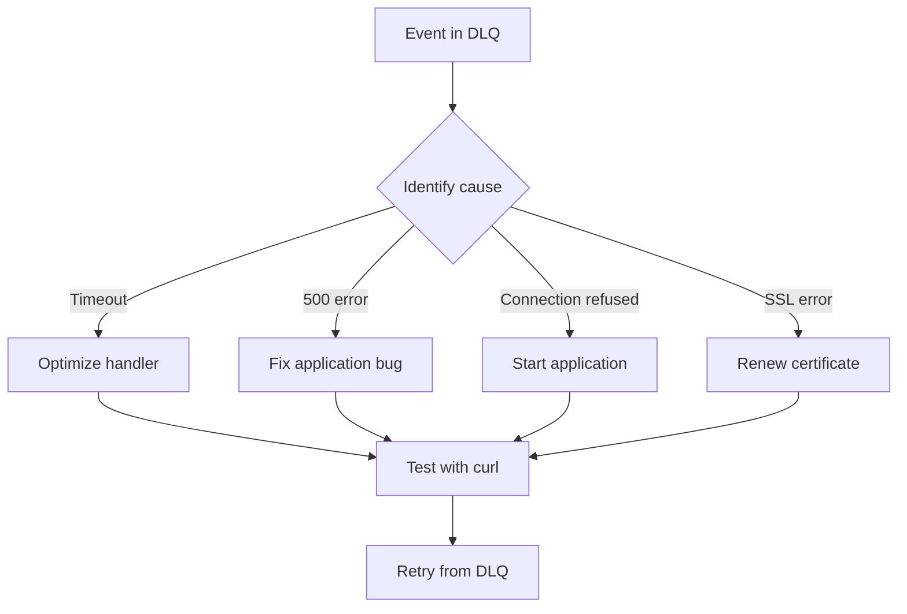

# Dead Letter Queue (DLQ)

The Dead Letter Queue is where webhook events go after failing all automatic retry attempts. Learn how to review, debug, and manually retry failed events.

## What is the Dead Letter Queue?

When a webhook fails to be delivered to your destination after **5 automatic retry attempts** (over approximately 13 minutes), it's moved to the Dead Letter Queue.

The DLQ ensures you **never lose a webhook event** - even when your application is down for extended periods.

## When Events Move to DLQ

Events move to the DLQ when:

1. ❌ Your destination returns 5xx errors consistently
2. ❌ Your destination times out (30 seconds)
3. ❌ Your destination is unreachable (DNS failure, connection refused)
4. ❌ SSL/TLS certificate errors
5. ✅ All 5 automatic retries have been exhausted

:::info Retry Timeline

- 1st attempt: Immediate
- 2nd attempt: After 5 seconds
- 3rd attempt: After 25 seconds
- 4th attempt: After 125 seconds (~2 minutes)
- 5th attempt: After 625 seconds (~10 minutes)
- **Then** → Moves to DLQ
  :::

## Accessing the Dead Letter Queue

1. Log in to your dashboard
2. Click the **"Dead Letter Queue"** tab


## Understanding the DLQ Table

Each failed event shows:

| Column            | Description                        |
| ----------------- | ---------------------------------- |
| **Checkbox**      | Select events for bulk retry       |
| **Source**        | The vendor that sent the webhook   |
| **Payload**       | Preview of the webhook data        |
| **Timestamp**     | When it was originally received    |
| **Failed Reason** | Why delivery failed                |
| **Retry Button**  | Manually retry this specific event |

## Failed Reasons Explained

### Connection Refused

```
Your destination server refused the connection
```

**Common causes:**

- Application is down
- Wrong destination URL
- Firewall blocking Relae's IPs

**Fix:**

1. Verify your destination URL is correct
2. Ensure your application is running
3. Check firewall rules

### Timeout

```
Request timed out after 30 seconds
```

**Common causes:**

- Slow database queries in your webhook handler
- Processing too much data synchronously
- Network latency issues

**Fix:**

1. Optimize your webhook handler performance
2. Process webhooks asynchronously (return 200 immediately)
3. Add database indexes

### 500 Internal Server Error

```
Your application returned HTTP 500
```

**Common causes:**

- Unhandled exception in your code
- Database connection issues
- Missing required data

**Fix:**

1. Check your application error logs
2. Add error handling to webhook endpoint
3. Validate required fields exist

### Invalid SSL Certificate

```
SSL certificate verification failed
```

**Common causes:**

- Expired SSL certificate
- Self-signed certificate
- Certificate chain issues

**Fix:**

1. Renew your SSL certificate
2. Use a valid CA-signed certificate
3. Ensure certificate chain is complete

### DNS Failure

```
Could not resolve hostname
```

**Common causes:**

- Domain doesn't exist
- DNS not propagated yet
- DNS server issues

**Fix:**

1. Verify domain is correct
2. Wait for DNS propagation (up to 48 hours)
3. Test with curl to confirm DNS works

## Viewing Event Details

Click on any event row to see:

### Full Payload

The complete JSON body of the webhook:

```json
{
  "id": "evt_1234567890",
  "type": "payment_intent.succeeded",
  "data": {
    "object": {
      "id": "pi_1234567890",
      "amount": 5000
    }
  }
}
```

### Original Headers

All headers sent by the vendor:

```json
{
  "content-type": "application/json",
  "x-stripe-signature": "t=1701234567,v1=abc123...",
  "user-agent": "Stripe/1.0"
}
```

### Retry History

See all retry attempts with timestamps and error messages.

## Retrying Events

### Single Event Retry

1. Click the **"Retry"** button on the event row
2. Confirm the retry in the modal
3. Event is immediately reprocessed

If successful:

- ✅ Event moves from DLQ to Webhooks tab
- ✅ Status changes to "delivered"

If still failing:

- ❌ Event stays in DLQ
- ❌ New failure reason is shown

### Bulk Retry

Retry multiple events at once:

1. Check the boxes for events to retry
2. Click **"Retry (X)"** button in the header
3. Confirm bulk retry
4. All selected events are reprocessed


:::tip
Bulk retry is useful after fixing an issue that affected multiple events (e.g., after a deployment or server restart).
:::

## Searching & Filtering in DLQ

Use the search bar to find specific failed events:

**Examples:**

- `stripe` - Find all Stripe failures
- `timeout` - Find all timeout errors
- `payment_intent` - Find specific event types
- `500` - Find all 500 errors

## Best Practices

### 1. Monitor DLQ Daily

Check your DLQ regularly for:

- Unexpected failures
- Patterns in error messages
- Events that need attention

### 2. Fix Root Causes

Don't just retry - fix the underlying issue:



### 3. Process Asynchronously

To avoid timeouts, acknowledge webhooks immediately:

```javascript
// ✅ Good: Quick acknowledgment
app.post("/webhooks", async (req, res) => {
  // Return 200 immediately
  res.status(200).send("OK");

  // Process asynchronously
  processWebhookAsync(req.body);
});

// ❌ Bad: Slow synchronous processing
app.post("/webhooks", async (req, res) => {
  await slowDatabaseQuery();
  await sendEmail();
  await updateCache();
  res.status(200).send("OK"); // Too late!
});
```

### 4. Add Idempotency

Handle duplicate retries gracefully:

```javascript
app.post("/webhooks", async (req, res) => {
  const eventId = req.body.id;

  // Check if already processed
  const exists = await db.findEvent(eventId);
  if (exists) {
    return res.status(200).send("Already processed");
  }

  // Process new event
  await processWebhook(req.body);
  await db.saveEvent(eventId);

  res.status(200).send("OK");
});
```

### 5. Set Up Alerts

Get notified when events hit the DLQ:

1. Check DLQ count daily
2. Set up monitoring for high failure rates
3. Create alerts for specific error types

## Understanding Retry Behavior

### What Gets Retried

When you retry an event from the DLQ:

- ✅ Same payload
- ✅ Same headers (except timestamps)
- ✅ Fresh HMAC signature
- ✅ New timestamp in `X-Relae-Timestamp`

### What Changes

- 🔄 New attempt timestamp
- 🔄 Fresh signature (verify with current token)
- 🔄 Updated retry count in metadata

## Common Scenarios

### Scenario 1: Deployment Downtime

**Situation:** You deployed new code and your app was down for 20 minutes. 100 events in DLQ.

**Solution:**

1. Verify deployment is successful
2. Test with curl: `curl -X POST your-destination-url`
3. Select all events in DLQ
4. Bulk retry
5. Monitor for successful delivery

### Scenario 2: Database Connection Issues

**Situation:** Database was down, webhooks returning 500 errors.

**Solution:**

1. Fix database connection
2. Add connection retry logic to app
3. Test webhook endpoint works
4. Retry failed events from DLQ

### Scenario 3: Wrong Destination URL

**Situation:** Typo in destination URL, all webhooks failing with "Connection Refused".

**Solution:**

1. Go to Destinations tab
2. Edit the destination
3. Fix the URL typo
4. Save changes
5. Return to DLQ and bulk retry

### Scenario 4: Timeout During High Load

**Situation:** Heavy traffic caused timeouts, some webhooks in DLQ.

**Solution:**

1. Optimize webhook handler (process async)
2. Scale application servers
3. Add caching layer
4. Retry timed-out events from DLQ

## Debugging Failed Events

### Step-by-Step Debugging

1. **Click on failed event** to view details

2. **Check the failed reason**
   - Connection issue? Check destination URL
   - Timeout? Optimize your handler
   - 500 error? Check application logs

3. **Test destination URL**

   ```bash
   curl -X POST https://your-destination-url.com/webhook \
     -H "Content-Type: application/json" \
     -d '{"test": true}'
   ```

4. **Review application logs**
   - Check around the timestamp
   - Look for exceptions or errors
   - Verify webhook was received

5. **Verify signature verification**
   - Make sure you're using correct endpoint token
   - Check signature format: `sha256={hash}`
   - Validate timestamp tolerance

6. **Fix the issue** in your application

7. **Retry the event** from DLQ

### Using Event Details for Debugging

The event details modal shows everything you need:

```json
{
  "headers": {
    "x-relae-signature": "sha256=abc123...",
    "x-relae-timestamp": "1701234567",
    "x-relae-source": "stripe",
    "content-type": "application/json"
  },
  "body": {
    // Full webhook payload
  },
  "metadata": {
    "retry_count": 5,
    "failed_reason": "Connection refused",
    "last_retry_at": "2024-01-15T10:30:00Z"
  }
}
```

## Data Retention in DLQ

Events in the DLQ follow your tier's retention policy:

| Tier       | DLQ Retention |
| ---------- | ------------- |
| Builder    | 7 days        |
| Launch     | 14 days       |
| Scale      | 30 days       |
| Enterprise | Custom        |

:::warning
Failed events are **automatically deleted** after the retention period. If you need to keep them:

1. Export the payload (copy/paste)
2. Store in your own systems
3. Or upgrade to a tier with longer retention
   :::

## Preventing DLQ Events

The best strategy is to prevent events from reaching the DLQ:

### 1. Reliable Infrastructure

- Use load balancers
- Auto-scaling groups
- Health checks

### 2. Fast Webhook Handlers

- Return 200 immediately
- Process asynchronously
- Keep handlers under 5 seconds

### 3. Error Handling

```javascript
app.post("/webhooks", async (req, res) => {
  try {
    // Acknowledge immediately
    res.status(200).send("OK");

    // Process with error handling
    await processWebhook(req.body);
  } catch (error) {
    // Log but don't throw
    console.error("Webhook processing error:", error);
    // Event still acknowledged successfully
  }
});
```

### 4. Monitoring

- Set up uptime monitoring
- Track response times
- Alert on elevated error rates

### 5. Testing

- Test webhook endpoints regularly
- Simulate failures in staging
- Verify retry behavior

## Next Steps

- [Understand Automatic Retries →](/core-concepts/retries)
- [Learn About Events →](/core-concepts/events)
- [View Analytics →](/guides/analytics)
- [Verify Signatures →](/guides/verifying-signatures)

## Need Help?

Having trouble with the DLQ?

- 📧 Email: [support@relaehook.com](mailto:support@relaehook.com)
- 💬 Check the [FAQ](/faq)
- 🐛 Report issues on [GitHub](https://github.com/WillBallentine/relae-docs/issues)
