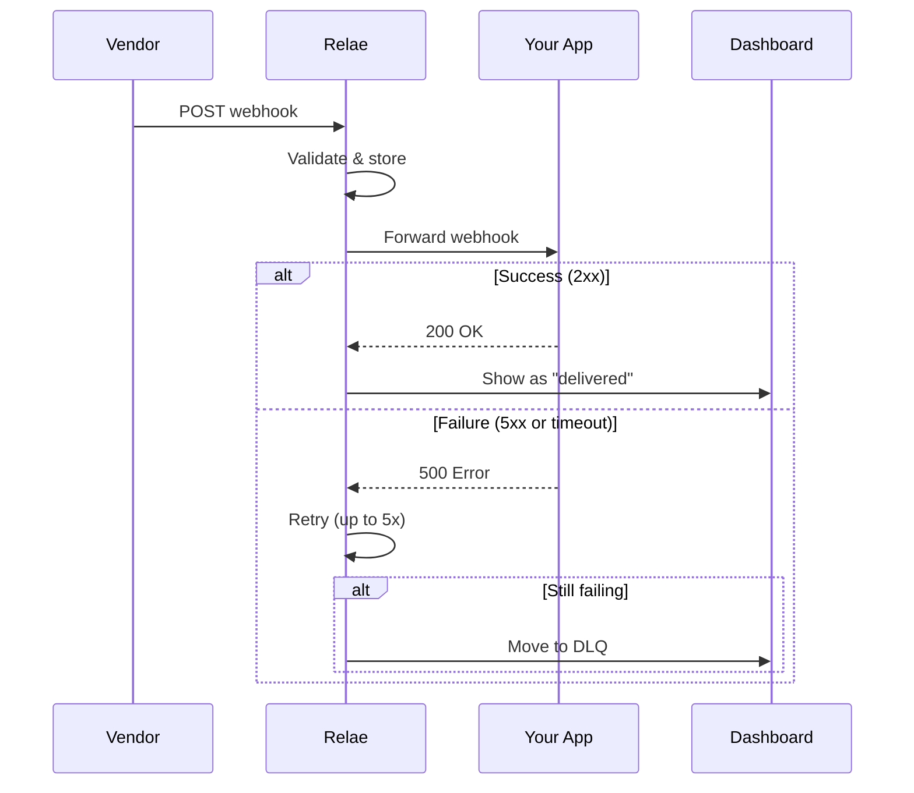

# Managing Webhooks

Learn how to view, search, filter, and manage your webhook events in the Relae dashboard.

## Accessing the Webhooks Dashboard

1. Log in to [relaehook.com/dashboard](https://relaehook.com/dashboard)
2. Click the **"Webhooks"** tab

This view shows all **successfully delivered** webhook events.


## Understanding the Webhooks Table

Each webhook event displays:

| Column        | Description                                                  |
| ------------- | ------------------------------------------------------------ |
| **Source**    | The vendor that sent the webhook (e.g., `stripe`, `shopify`) |
| **Payload**   | Preview of the webhook data (first 100 characters)           |
| **Timestamp** | When the webhook was received by Relae                       |
| **Status**    | Current delivery status (`delivered`, `pending`, `failed`)   |

## Viewing Webhook Details

Click on any webhook row to open the details modal:


### What You'll See

#### Headers Section

All HTTP headers received with the webhook:

```json
{
  "content-type": "application/json",
  "x-stripe-signature": "t=1701234567,v1=abc123...",
  "user-agent": "Stripe/1.0",
  "x-relae-source": "stripe"
}
```

#### Payload Section

The complete webhook body in formatted JSON:

```json
{
  "id": "evt_1234567890",
  "object": "event",
  "type": "payment_intent.succeeded",
  "data": {
    "object": {
      "id": "pi_1234567890",
      "amount": 5000,
      "currency": "usd",
      "status": "succeeded"
    }
  }
}
```

:::tip
Click anywhere outside the modal or press `ESC` to close it.
:::

## Searching & Filtering

### Search Bar

Use the search bar to find specific webhooks:

```
Search by source, status, or payload...
```

**Examples:**

- `stripe` - Find all Stripe webhooks
- `payment_intent` - Find webhooks containing "payment_intent"
- `delivered` - Filter by status
- `evt_12345` - Search by event ID in payload

The search is **case-insensitive** and searches across:

- Source name
- Status
- Entire payload (JSON)

### Sorting

Click any column header to sort:

- **Source**: Alphabetically (A-Z or Z-A)
- **Timestamp**: Chronologically (newest first or oldest first)
- **Status**: By delivery status

The current sort field and direction are indicated by the arrow icon.

## Pagination

By default, 10 webhooks are shown per page. Use the pagination controls at the bottom:

- **← Previous**: Go to previous page
- **Next →**: Go to next page
- **Page X of Y**: Shows current position

## Webhook Statuses

### Delivered ✅

The webhook was successfully forwarded to your destination and your application returned a 2xx status code.

### Pending ⏳

The webhook is currently being processed or retried. This is temporary.

### Failed ❌

The webhook failed after all retry attempts and has been moved to the Dead Letter Queue.

## Refresh Data

Click the **"Refresh"** button in the top right to reload the latest webhook events.

:::tip Auto-refresh
The dashboard automatically refreshes every 30 seconds when you're actively viewing it.
:::

## Filtering by Time Period

While there's no date picker UI, you can use the search to filter by approximate timeframe:

1. Note the timestamps in the table
2. Use pagination to navigate to earlier events
3. Events are ordered by most recent first

## Understanding Webhook Flow



## Best Practices

### 1. Regular Monitoring

Check your webhook dashboard daily to ensure:

- Events are being received
- Success rate is high (>99%)
- No unexpected sources

### 2. Investigate Failed Events

If you see events with "failed" status:

1. Click to view details
2. Check the error message
3. Verify your destination URL is correct
4. Review your application logs

### 3. Use Search Effectively

Save time by using specific search terms:

- Search by event type: `payment_intent.succeeded`
- Search by customer: `cus_1234567890`
- Search by amount: `5000` (if amounts are in payload)

### 4. Export Important Events

If you need to keep webhooks beyond your retention period:

1. Click on the event to view details
2. Copy the full payload
3. Save to your own systems

:::warning Data Retention
Events are automatically deleted after your tier's retention period:

- **Builder**: 7 days
- **Launch**: 14 days
- **Scale**: 30 days
- **Enterprise**: Custom

Plan accordingly and export critical data.
:::

## Common Tasks

### Finding a Specific Payment

```
1. Go to Webhooks tab
2. Search for: payment_intent or invoice
3. Look for specific ID in payload preview
4. Click to view full details
```

### Checking Recent Activity

```
1. Go to Webhooks tab
2. Sort by Timestamp (newest first)
3. Review recent events
4. Click Refresh to update
```

### Verifying Delivery

```
1. Note the timestamp from your vendor
2. Search for that event in Relae
3. Check status is "delivered"
4. Verify in your application logs
```

### Debugging an Integration

```
1. Send test webhook from vendor
2. Wait a few seconds
3. Refresh Relae dashboard
4. Find the test event
5. Click to view full payload and headers
6. Compare with vendor documentation
```

## Understanding the UI

### Color Coding

- **Green badges**: Successful delivery
- **Yellow badges**: Pending or in progress
- **Red badges**: Failed or error state
- **Gray text**: Metadata and secondary info

### Icons

- **🔍 Search**: Find specific events
- **🔄 Refresh**: Reload latest data
- **📋 Details**: View full webhook data
- **⏰ Timestamp**: When event was received

## Performance Tips

### For Large Event Volumes

If you have thousands of events:

1. **Use search** instead of scrolling through pages
2. **Be specific** with search terms to reduce results
3. **Upgrade tier** for longer retention if needed
4. **Export regularly** if you need historical data

### Optimizing Your View

1. Sort by timestamp to see newest first
2. Use search to filter to relevant sources only
3. Focus on failed events (in DLQ) for troubleshooting
4. Check Analytics tab (Scale+) for aggregate metrics

## Troubleshooting

### Events Not Appearing

**Check:**

1. Vendor is sending to correct Relae endpoint
2. Webhook signature is valid (if configured)
3. You're looking at Webhooks tab (not DLQ)
4. Search/filter isn't hiding results

### Can't Find Specific Event

**Try:**

1. Clear search bar
2. Sort by timestamp (newest first)
3. Navigate through pages
4. Check DLQ tab (it might have failed)
5. Verify event was actually sent by vendor

### Status Shows "Pending" for Too Long

**This means:**

- Event is still being retried
- Your destination might be slow to respond
- Check your application logs for issues

After 5 failed retries, it will move to DLQ.

## Next Steps

- [Learn about the Dead Letter Queue →](/guides/dead-letter-queue)
- [View Analytics (Scale tier) →](/guides/analytics)
- [Understand Retry Logic →](/core-concepts/retries)
- [Verify Signatures →](/guides/verifying-signatures)

## Need Help?

Can't find what you're looking for?

- 📧 Email: [support@relaehook.com](mailto:support@relaehook.com)
- 📖 Check the [FAQ](/faq)
- 💬 Share feedback via the dashboard
