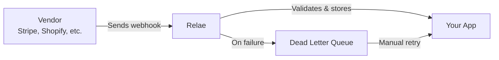

# Welcome to Relae

**Relae** is a webhook relay service that ensures 100% delivery reliability for your critical webhook events. We sit between your vendors (like Stripe, Shopify, GitHub, etc.) and your application, providing automatic retries, monitoring, and a dead letter queue for failed events.

## Why Relae?

Webhooks are critical for real-time integrations, but they're notoriously unreliable:

- ❌ **Lost events** when your server is down
- ❌ **No retry mechanism** from most vendors
- ❌ **Difficult to debug** webhook failures
- ❌ **Security concerns** with unverified webhooks
- ❌ **Manual monitoring** required

### Relae solves all of this:

- ✅ **Guaranteed delivery** with automatic retries
- ✅ **Dead letter queue** to never lose an event
- ✅ **Real-time monitoring** and analytics
- ✅ **HMAC signature verification** for security
- ✅ **Automatic retry with exponential backoff**
- ✅ **Per-vendor endpoint isolation** for security

## How It Works

1. **Vendor sends webhook** → Your vendor sends a webhook to your unique Relae endpoint
2. **Relae receives & validates** → We validate the signature (if configured) and store the event
3. **Forward to your app** → We forward the webhook to your destination URL with custom headers
4. **Automatic retries** → If delivery fails, we retry up to 5 times with exponential backoff
5. **Dead Letter Queue** → Failed events go to the DLQ where you can review and manually retry

## Key Features

### 🔄 Automatic Retries

Failed webhooks are retried automatically (up to 5 times) with exponential backoff before moving to the dead letter queue.

### 📬 Dead Letter Queue

Never lose a webhook. All failed events are stored in a DLQ where you can review, debug, and manually retry them.

### 🔐 Security First

- **Incoming verification**: Validate webhooks from vendors using their signature secrets
- **Outgoing signing**: All forwarded webhooks include an HMAC-SHA256 signature you can verify
- **Per-endpoint isolation**: Each vendor gets its own unique endpoint that can be rotated independently

### 📊 Analytics & Monitoring

Track delivery rates, response times, and failure patterns with detailed analytics (Scale tier and above).

### ⚡ Lightning Fast

Sub-100ms processing and forwarding times. Your webhooks are delivered in real-time.

### 🎯 Custom Headers

Add authentication tokens, API keys, or any custom headers to forwarded webhooks.

## Quick Links

  

    

      <h3>🚀 Quick Start</h3>
    

    

      
Get started with Relae in 5 minutes

    

    

      <a href="/quickstart/overview" className="button button--primary button--block">Get Started</a>
    

  

  

    

      <h3>📚 Core Concepts</h3>
    

    

      
Understand how Relae works

    

    

      <a href="/core-concepts/what-is-relae" className="button button--secondary button--block">Learn More</a>
    

  

  

    

      <h3>🔌 API Reference</h3>
    

    

      
Complete API documentation

    

    

      <a href="/api/authentication" className="button button--secondary button--block">View API Docs</a>
    

  

## Pricing Tiers

| Feature      | Builder (Free) | Launch ($35/mo) | Scale ($65/mo) | Enterprise |
| ------------ | -------------- | --------------- | -------------- | ---------- |
| Events/month | 10,000         | 100,000         | 500,000        | Unlimited  |
| Retention    | 7 days         | 14 days         | 30 days        | Custom     |
| Analytics    | ❌             | ❌              | ✅             | ✅         |
| Support      | Email          | Priority        | Priority       | 24/7       |

[View full pricing →](https://relaehook.com/#pricing)

## Need Help?

- 📧 Email: [support@relaehook.com](mailto:support@relaehook.com)
- 💬 Have a question? Check our [Guides](/guides/managing-webhooks)
- 🐛 Found a bug? [Report it on GitHub](https://github.com/WillBallentine/relae-docs/issues)
