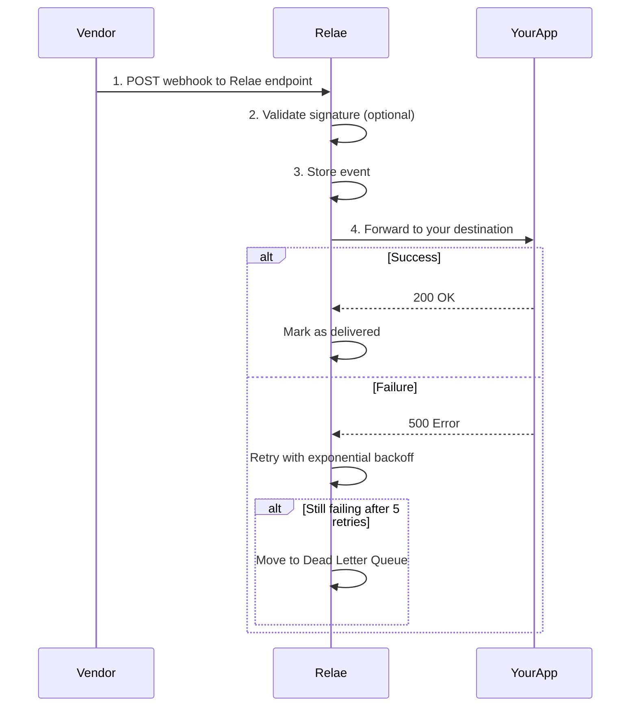

# Quick Start Overview

Get up and running with Relae in just 5 minutes. This guide will walk you through the entire process from signup to receiving your first webhook.

## What You'll Accomplish

By the end of this quick start guide, you'll have:

1. ✅ Created a Relae account
2. ✅ Set up your first webhook destination
3. ✅ Configured your vendor to send webhooks to Relae
4. ✅ Received and forwarded your first webhook event
5. ✅ Verified the HMAC signature on the forwarded webhook

## Prerequisites

Before you begin, make sure you have:

- A valid email address for account creation
- A vendor account that supports webhooks (Stripe, Shopify, GitHub, etc.)
- An endpoint URL where you want to receive webhooks (your application)

:::tip Your Application Endpoint
Your application needs an HTTP endpoint that can receive POST requests. This can be:

- Your production API: `https://api.yourdomain.com/webhooks`
- A staging server: `https://staging.yourdomain.com/webhooks`
- For testing: Use [webhook.site](https://webhook.site) or [RequestBin](https://requestbin.com) to get a temporary URL
  :::

## The Process

Here's how webhook delivery works with Relae:

## Estimated Time

- **Account setup**: 2 minutes
- **Destination configuration**: 2 minutes
- **Vendor integration**: 1-5 minutes (depending on vendor)

**Total**: ~5-10 minutes

## Ready to Start?

Let's begin with [Setting Up Your Account](/quickstart/setup) →

## Need Help?

If you run into any issues during setup:

1. Check the [Common Issues](#common-issues) section below
2. Review the [Core Concepts](/core-concepts/what-is-relae) for deeper understanding
3. Email us at [support@relaehook.com](mailto:support@relaehook.com)

## Common Issues

<b>I don't have an application endpoint yet</b>

No problem! For testing purposes, you can use:

- [webhook.site](https://webhook.site) - Instant test endpoint
- [RequestBin](https://requestbin.com) - Another great testing tool
- [Ngrok](https://ngrok.com) - Tunnel to your localhost for development

These services give you a temporary URL where you can see incoming webhooks in real-time.

<b>My vendor doesn't allow custom webhook URLs</b>

Most webhook providers allow you to configure custom endpoints. Look for:

- "Webhooks" or "API Webhooks" in settings
- "Notifications" or "Integrations"
- "Developer Settings" or "API Configuration"

If you can't find it, contact your vendor's support team.

<b>What if my application is down?</b>

That's exactly why Relae exists! If your application is down or returns an error:

1. Relae will automatically retry the webhook up to 5 times
2. Each retry uses exponential backoff (wait longer between attempts)
3. After 5 failed attempts, the event moves to the Dead Letter Queue
4. You can manually retry events from the DLQ when your app is back online

You'll never lose a webhook event.

<b>Do I need to verify signatures twice?</b>

No! Relae handles this for you:

- **Incoming**: Relae verifies the vendor's signature (if you provide the secret)
- **Outgoing**: Relae signs the forwarded webhook with its own HMAC signature

You only need to verify Relae's signature on the forwarded webhook. This is actually more secure because each destination has its own unique signing secret.

## Next Steps

Ready to create your account? Head over to [Setup](/quickstart/setup) to get started! →
